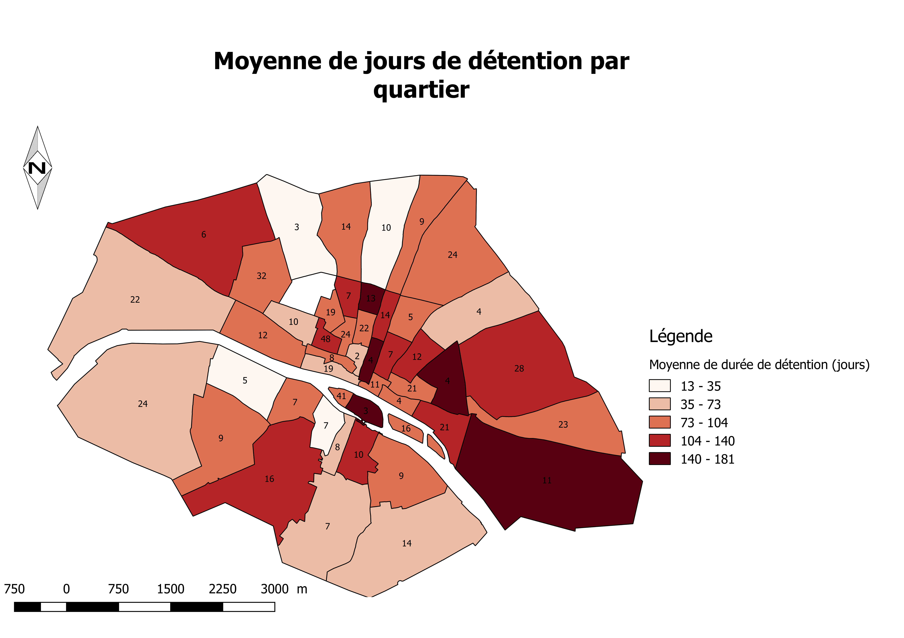

# Question

**Déterminer si la sévérité des peines prononcées, pour des délits semblables, par les juges varient en fonction du quartier de résidence du détenu à Paris.** 

- visualiser spatialement les différences en produisant plusieurs cartes puis en les réconciliants
- définition de catégories
- recours nécessaire à une analyse multivariée

# Préparation des données

### Relations mobilisées

TBL_individu
- ID_individu
- Nom_individu
- Quartier_paris

TBL_detention
- Duree_detention

TBL_motifdetention
- Label_motifdetention

### Sélection des délits

Sélection de délits à partir des regroupement de catégories déjà constituées, choix de quatre catégories en fonction de leur effectif et de la pertinence de la comparaison 

- (exclue évasion et surveillance comme non pertinent)
- suppression des effectifs trop restreints

10 résultats
- **contestataire**
- contravention
- crime de sang
- **escroquerie**
- évasion
- moeurs
- **petits delits**
- politique
- **social**
- surveillance

Exemple de requêtes dans pour l’évaluation des effectifs

```sql
SELECT count(code1)
FROM TBL_motifdetention
WHERE code1 = 'moeurs'
```

### Création de la table de données

Regroupements par individus (inutile pour la production des cartes)

```sql
SELECT a.ID_individu, a.ID_alpage_adresse, a.Num_quartier, a.Quartier_paris, b.Duree_detention, c.code1
FROM TBL_individu AS a, TBL_detention AS b, TBL_motifdetention as c
WHERE a.ID_individu = b.ID_individu_detention AND b.ID_detention = c.ID_detention
AND (c.code1 = 'Petits  délits' OR c.code1 = 'escroquerie' OR c.code1 = 'social' OR  c.code1 = 'contestataire')
```

- pb adresses (insuffisamment renseignées)
- pb regroupement par arrondissement à partir des individus dans QGIS

= Regroupement par quartier

```sql
SELECT a.ID_individu, a.ID_alpage_adresse, a.Num_quartier, a.Quartier_paris, b.Duree_detention, c.code1 
FROM TBL_individu AS a, TBL_detention AS b, TBL_motifdetention as c 
WHERE a.ID_individu = b.ID_individu_detention AND b.ID_detention = c.ID_detention AND (c.code1 = 'Petits délits' OR c.code1 = 'escroquerie' OR c.code1 = 'social' OR c.code1 = 'contestataire')
```


## Création des cartes

- Classification de Jenks sur les durées

- Légendes pour les effectifs

  ### 




## Limites

- Cartes seulement pertinente pour l’analyse d’adjacence
- Obligation de multiplier les cartes pour la comparaison
  - superposition des cartes qui pose des pbs de réalisation pratique (RVB, CMYN, sapin de Noël !)
  - ambiguïtés de la représentation en fonction de l’effectif
- Effectifs réduits, disparité statistique
- Catégories qui ne permettent pas de déterminer la gravité des délits 

## Analyse factorielle

Corrélation, en fonction de la nature des données statistiques opère des corrélation différente.


http://analyse.univ-paris1.fr

Est-ce que à crime égal on est jugé plus sévèrement en fonction de son quartier d’origine.


